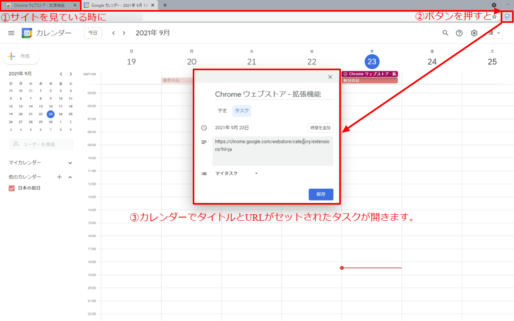

# google-task-creator

This is a Chrome extension supports to create a task of Google Todo List. For use only, it will be able to get from [Chrome Web Store](https://chrome.google.com/webstore).

## Features

### Create a task by clicking extension button on browser

### Create a task by context menu on links

## Roadmap

See [Issues](https://github.com/GOAMI-Takaaki/google-task-creator/issues) of this repositry.

## Get Started

### Prerequisites

- Google Chrome

### Prepare

1. Download this repository to the local

### Deploy

1. Open [Chrome Extension](chrome://extensions/) page
1. Turn on developer mode
1. Load unpacked extension and choose the downloaded directory on a dialog

## Contributing

1. Fork this repository to your account
1. Change something and test them.
1. Send pull requests to Code Owner

## License

Distributed under the MIT License. See [LICENSE](LICENSE) for more information.

## Contact

Basically, contact me at [Discussion](https://github.com/GOAMI-Takaaki/google-task-creator/discussions) of this repository.
